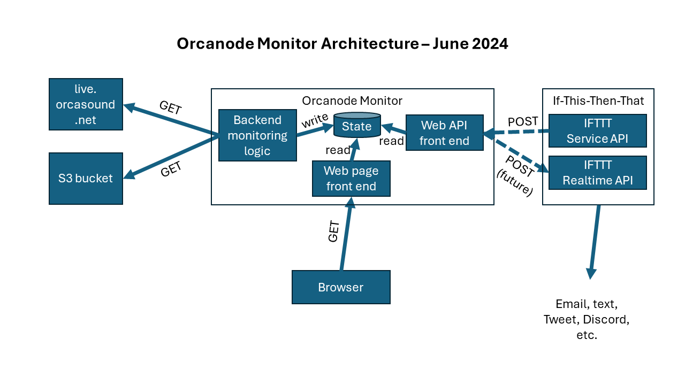

# Orcanode Monitor Design

## Backend Monitoring Logic

The web service will be deployed as an azurewebsites.net service.  Periodically, at a frequency that can be
configured by an administrator, the service will do the following:

1. Enumerate the orcanodes listed at https://live.orcasound.net/api/json/feeds and update the internal list
   of nodes, tracking the “node_name” and “bucket”, for each orcanode.

2. For each orcanode found in step 1:

   a. Query the latest timestamp by fetching “https://{bucket}.s3.amazonaws.com/{node_name}/latest.txt”
      (e.g., https://streaming-orcasound-net.s3.amazonaws.com/rpi_orcasound_lab/latest.txt for the Orcasound
      Lab node).  This could possibly be optimized by storing the Last-Modified header value and using
      If-Modified-Since in subsequent queries, but since the content is so small the optimization does not
      seem worth it.

   b. If the timestamp is new, query the manifest file by fetching
      “https://{bucket}.s3.amazonaws.com/{node_name}/hls/{timestamp}/live.m3u8”
      (e.g., https://streaming-orcasound-net.s3.amazonaws.com/rpi_port_townsend/hls/1717439421/live.m3u8
      for the Port Townsend node).

   c. Update the state of the orcanode in stable storage.  Other internal modules can register for notifications
      of changes to this state.

3. Enumerate the orcanodes listed at
   [https://apps.dataplicity.com/devices](https://docs.dataplicity.com/reference/devicessearch) and update the
   internal list of nodes, tracking the "name" and "online", for each orcanode.

4. For each orcanode found in step 3:

   a. Update the state of the orcanode in stable storage.  Other internal modules can register for notifications

The following state will be stored per orcanode:

  * **name**: The human-readable name from the “name” obtained in step 1.

  * **s3_node_name**: The URI path component from the “node_name” obtained in step 1.

  * **s3_bucket**: The hostname component from the “bucket” obtained in step 1.

  * **slug**: The URI path component from the “slug” obtained in step 1.

  * **latest-recorded**: The Unix timestamp value in the latest.txt file obtained in step 2a (Question as recorded on the orcanode?)

  * **latest-uploaded**: The Last-Modified timestamp on the latest.txt file as recorded by Amazon, obtained in step 2a.

  * **manifest-updated**: The Last-Modified timestamp on the manifest file as recorded by Amazon, obtained in step 2b.

  * **dataplicity-name**: The value of the "name" field obtained in step 3.

  * **dataplicity-description**: The value of the "description" field obtained in step 3.

  * **dataplicity-upgrade-available**: The value of the "upgrade_available" field obtained in step 3.

  * **dataplicity-online**: The value of the "online" field obtained in step 3.

### Configured parameters

**ORCASOUND_POLL_FREQUENCY_IN_MINUTES**: Service will poll each orcanode at the configured frequency.

**ORCASOUND_MAX_UPLOAD_DELAY_MINUTES**: If the manifest file is older than this, the node will be considered offline.

## Web page front end

The proposed web service would expose a web page that would display, for each node, the current state and potentially
also the recent history of the state including % uptime over some time period.

## If-This-Then-That (IFTTT) Integration

The service will act as a "Shim App" in the [IFTTT Architecture](https://ifttt.com/docs/process_overview):

and expose endpoints for an [IFTTT Service API](https://ifttt.com/docs/api_reference).  For the
present, no authentication will be required since all state is read-only and public information.

An IFTTT-compatible service can implement:

 * **Triggers**: These are HTTPS API endpoints the service exposes that IFTTT can poll to fetch events
   that can be used to trigger IFTTT Applets. IFTTT docs explain that “IFTTT will fire an Applet’s
   action for each new item returned by the trigger.  Events should remain on the timeline indefinitely
   and should not expire, although they may roll off the bottom of the list once the timeline exceeds 50 items.”

 * **Actions**: These are HTTPS API endpoints the service exposes that IFTTT can call to cause actions
   to occur as directed by an IFTTT Applet.  Currently, this capability will not be used.

 * **Realtime notifications**: These are HTTP API endpoints that IFTTT exposes that the service can call
   to notify IFTTT that new information is available at a trigger API the service exposes.  In other words,
   when something critical changes, the [IFTTT Realtime API](https://ifttt.com/docs/api_reference#realtime-api)
   can be used to notify IFTTT that new information is available.  This will cause IFTTT to call the
   service’s trigger API to fetch the latest data.

### Configured parameters

**api_url_prefix**: The URI prefix to use for exposing the IFTTT Service API
